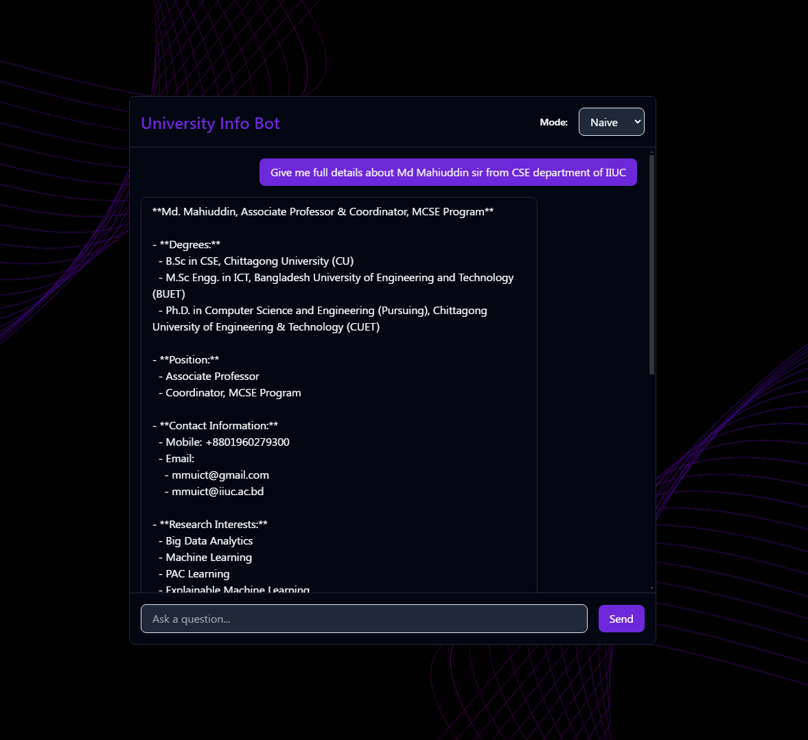
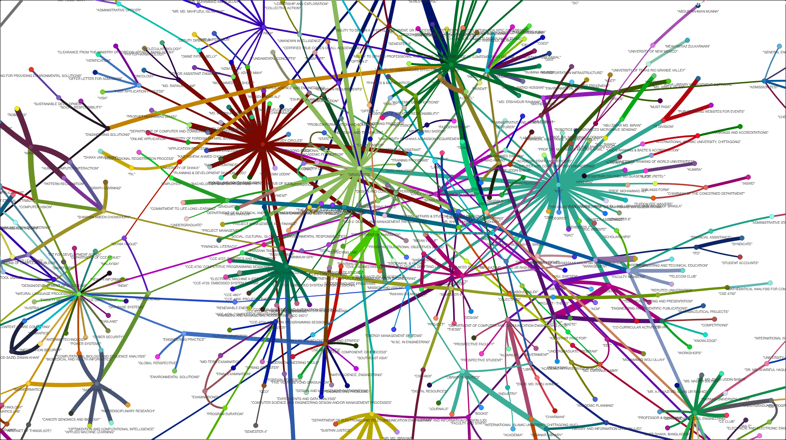

# Enhancing LLMs with Graph-Based Retrieval-Augmented Generation (RAG)

This project focuses on a **Retrieval-Augmented Generation (RAG)** system enhanced with graph-based indexing to deliver accurate, context-rich, and scalable question-answering solutions. The system is tailored to provide domain-specific information for the **International Islamic University Chittagong (IIUC)**, featuring a seamless and interactive user experience.

## Features

- **Graph-Based Text Indexing**: Leverages knowledge graphs to capture relationships between entities, preserving both local and global context.
- **Dual-Level Retrieval Mechanism**: Provides four retrieval modes:
  - **Naive**: Direct interaction with the LLM.
  - **Local**: Focuses on specific, detail-oriented queries.
  - **Global**: Offers broad, conceptual overviews.
  - **Hybrid**: Combines local and global modes for comprehensive responses.
- **Efficient Updates**: Supports incremental updates to integrate new data without re-indexing the entire corpus.
- **User-Friendly Interface**: React-based frontend with real-time, streaming responses for a chat-like experience.

## Technology Stack

- **Backend**: FastAPI and LightRAG
  - Embedding: `nomic-embed-text`
  - LLM: `qwen2.5:7b` served by Ollama
- **Frontend**: React
  - Interactive features like typed-response streaming.
- **Knowledge Representation**: Knowledge graphs to model entities and relationships within IIUC.

## Methodology

1. **Data Collection**: Extracted data from IIUC's official sources, processed, and segmented into manageable chunks.
2. **Knowledge Graph Construction**: Captured inter-entity relationships for structured indexing.
3. **LightRAG Innovations**:
   - Graph-based indexing for improved contextual understanding.
   - Dual-level retrieval to balance precision and coverage.
4. **Frontend Implementation**:
   - Real-time answer streaming for enhanced interactivity.
   - Flexible mode selection for tailored responses.

## Objectives

1. **Accuracy**: Deliver precise answers about IIUC’s structure, faculty, and programs.
2. **Efficiency**: Enable rapid integration of new or updated data.
3. **User Experience**: Provide a responsive and interactive chat interface.
4. **Showcase Graph Utility**: Highlight the advantages of knowledge graphs in domain-specific applications.

## Visualizations

### User Interface

### Knowledge Graph

## Video Showcase

Check out the project in action below:

## Conclusion

This project demonstrates the potential of **graph-enhanced RAG systems** in addressing challenges like context preservation, relationship modeling, and scalability. It offers a robust solution for domain-specific queries, paving the way for future enhancements such as:
- Advanced inference mechanisms in knowledge graphs.
- Multi-lingual support.
- Integration with real-time data sources.

## Authors

- **Oahed Noor Forhad** (C213056)
- **Tohedul Islam Nirzon** (C213060)
- **Saiful Islam Rumi** (C211080)